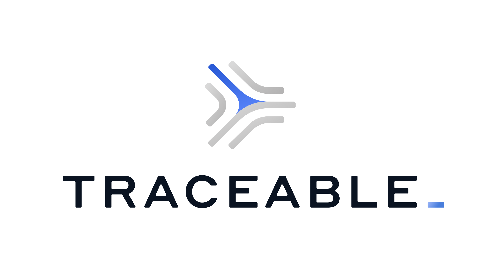

---

layout: col-sidebar
title: OWASP Cincinnati
site_side: true
tags: cincinnati
meetup group: owasp-cincinnati-meetup-group
level: 3
country: USA
region: North America

---
<!-- rebuild -->

# Welcome to the Cincinnati, Ohio OWASP Local Chapter

Cincinnati OWASP chapter meetings are free and open to anyone interested in
information security, risk management, data protection and application security.
Chapter meetings are generally held every one to two months.

## Check our Upcoming Meetup Events



If you have never attended a meeting before and you are interested to attend one
in the future, please join the [OWASP Slack](https://owasp.org/slack/invite)
(in the #chapter-cincinnati channel) or follow us on
[Meetup](https://www.meetup.com/owasp-cincinnati-meetup-group/).

The board currently includes the following members:

**Chapter Leader:** [Shlomo Heigh](mailto:shlomo.heigh@owasp.org)

**Chapter Leader:** [James Simmons](mailto:j.simmons@owasp.org)

## Sponsors

The OWASP Cincinnati Chapter is proudly sponsored by:

## Call For Speakers

If you are interested in presenting at one of the chapter meetings
please send an abstract and bio to the
[chapter chair (Shlomo Heigh)](mailto:shlomo.heigh@owasp.org). Prior to participating,
please review the [Chapter Rules](https://owasp.org/www-policy/operational/chapters).

## About OWASP

The OWASP Foundation is a 501(c)3 non-profit organization incorporated
in the United States of America. OWASP's all-volunteer participants
produce free, professional quality, open-source documentation, tools,
and standards. Consult the [how OWASP
works](https://www.owasp.org/index.php/How_OWASP_Works) web page for
more information about projects and governance.

## OWASP Membership

OWASP is an open source project dedicated to finding and fighting the causes of
insecure software. All of our materials are free and offered under an open
source license, so you do not have to become a member to use them or participate
in our projects, mailing lists, conferences, meetings or other activities. On
the other hand OWASP relies on membership fees and sponsorship to support it's
activities. There are also unique benefits to become a corporate member such as
the use of OWASP materials within your organization without the restrictions
associated with the various open source licenses. OWASP individual members also
get discounts to security conferences and other perks. For more information
consult the [OWASP Membership](https://www.owasp.org/index.php/Membership) web
page.
